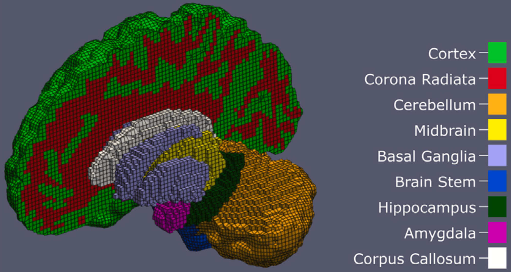
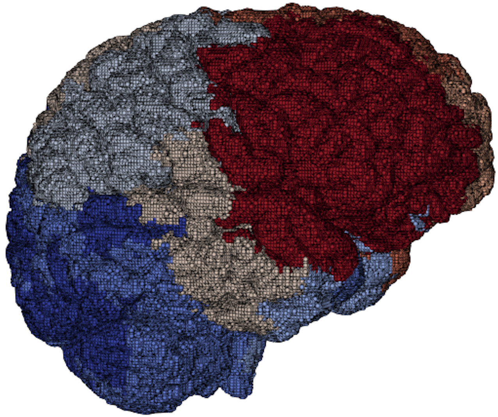

# brain (ExaBrain)

Brain-scale mechanics and inversion-oriented workflows built around the
in-house ExaBrain code base, with emphasis on scalable tissue models and
full-brain simulations.

[Repository](https://github.com/BRAINIACS-Group/ExaBrain)

|  |  |
| --- | --- |

- Focus: full-brain mechanics, inversion workflows, region-aware modeling.
- Status: public repository available; public project homepage not identified separately.
- Local path: `applications/brain/ExaBrain`
