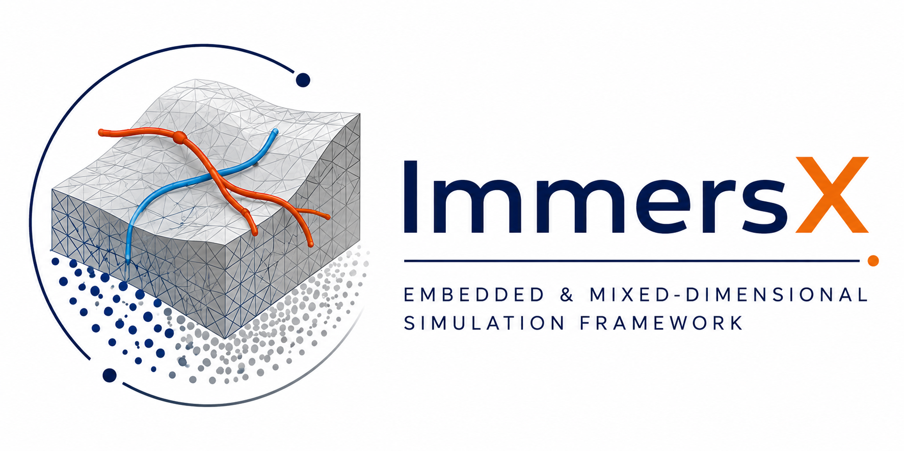
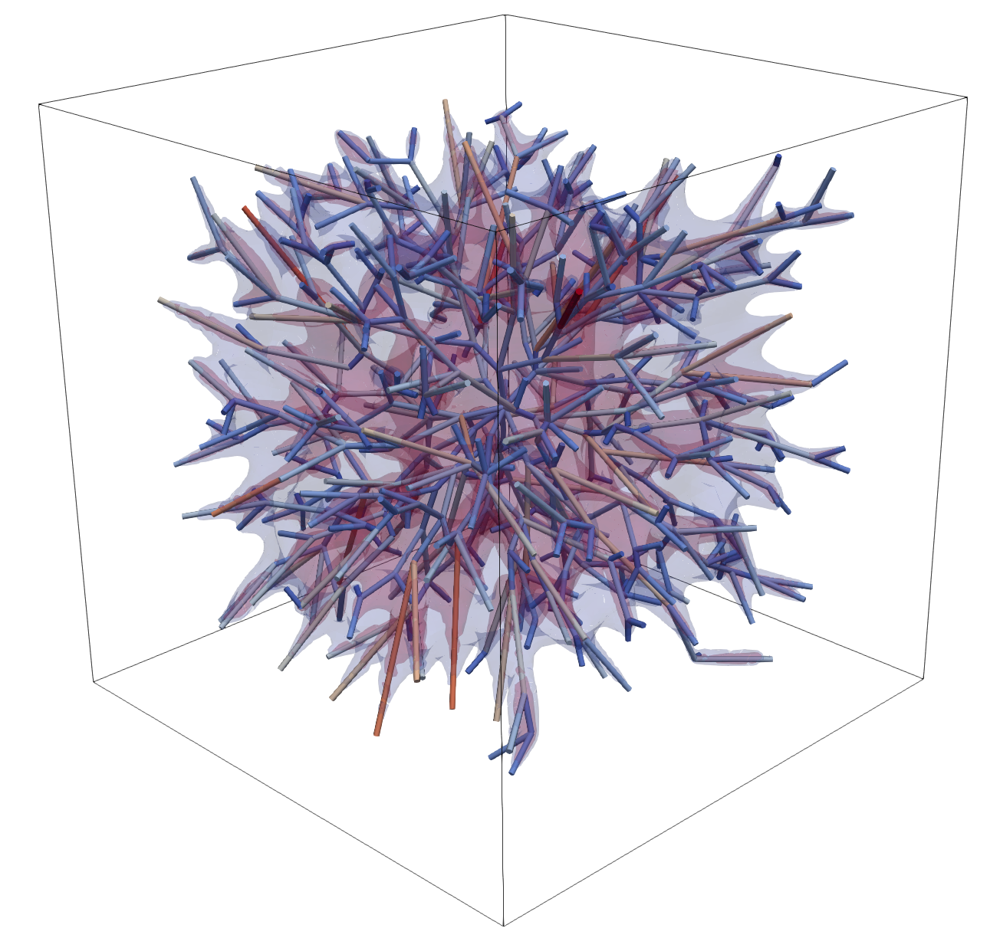

# liver (ImmersX)

Embedded and mixed-dimensional simulation framework used in dealii-X for
vascularized tissue and coupled 3D/1D liver workflows.

[Homepage](https://luca-heltai.github.io/immersx/) [Repository](https://github.com/luca-heltai/immersx)

|  |  |
| --- | --- |

- Focus: immersed coupling, reduced multiplier spaces, mixed-dimensional solvers.
- Highlights: elasticity, Poisson, embedded methods, and coupled vascular workflows.
- Local path: `applications/liver/immersx`
