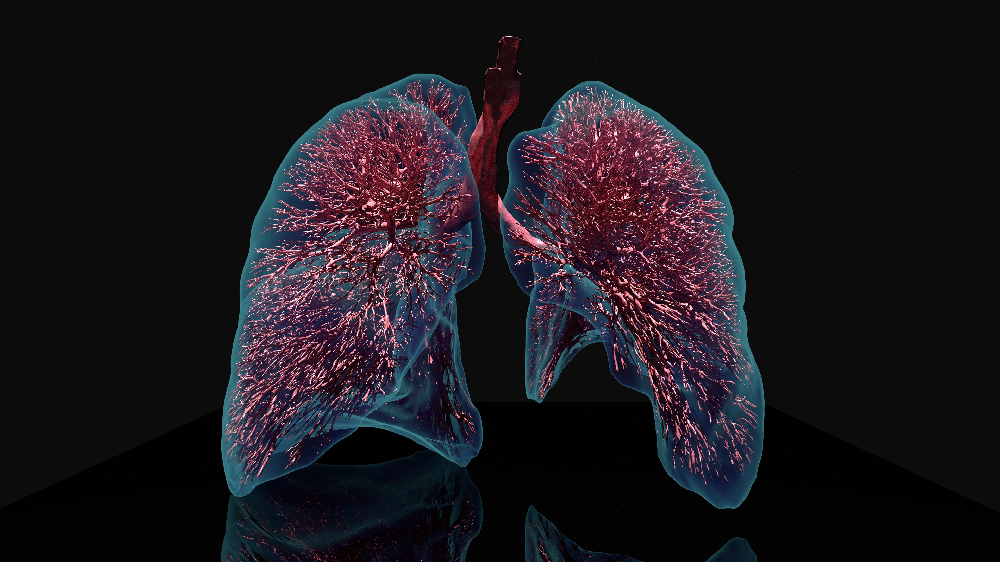

# lungs (ExaDG)

High-order discontinuous Galerkin application stack for flow and
transport problems, used in dealii-X for high-fidelity lung-oriented
simulation workflows.

[Homepage](https://exadg.github.io/exadg/index.html) [Repository](https://github.com/exadg/exadg)

  
  

- Focus: high-order DG solvers, matrix-free performance, scale-resolving CFD.
- Highlights: incompressible flow core, coupled transport workflows, exascale-oriented design.
- Local path: `applications/lungs/exadg`
