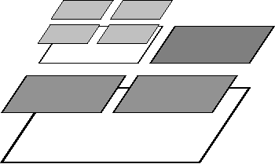

# deal.II

Core finite-element backbone for the dealii-X stack. It provides the
adaptive meshes, matrix-free operators, distributed data structures, and
solver interfaces used across the downstream repositories.

[Homepage](https://www.dealii.org/) [Repository](https://github.com/dealii/dealii)

  
  

- Role: shared numerical infrastructure for virtually every other code in this catalog.
- Highlights: adaptive finite elements, distributed meshes, matrix-free operators, broad external solver support.
- Local path: `libraries/dealii`
