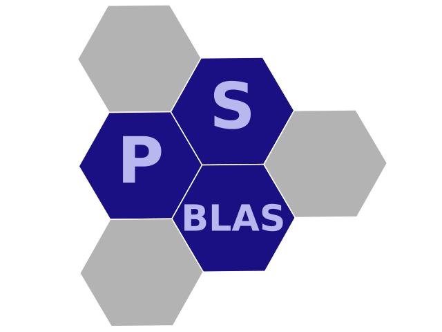
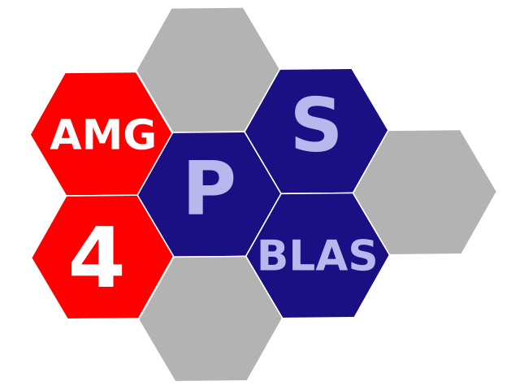

# PSCToolkit

Suite of parallel sparse linear-algebra libraries (PSBLAS, AMG4PSBLAS,
PSBLAS-EXT) with a SUNDIALS interface. In dealii-X it is part of the
robust scalable solver layer for large, difficult coupled systems.

[Homepage](https://psctoolkit.github.io/) [Repository](https://github.com/psctoolkit/psctoolkit)

  
  

- Role: scalable sparse linear algebra, algebraic multigrid, and preconditioning.
- Highlights: PSBLAS, PSBLAS-EXT, AMG4PSBLAS, and SUNDIALS integration in one toolkit.
- Local path: `libraries/psctoolkit`
