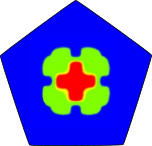
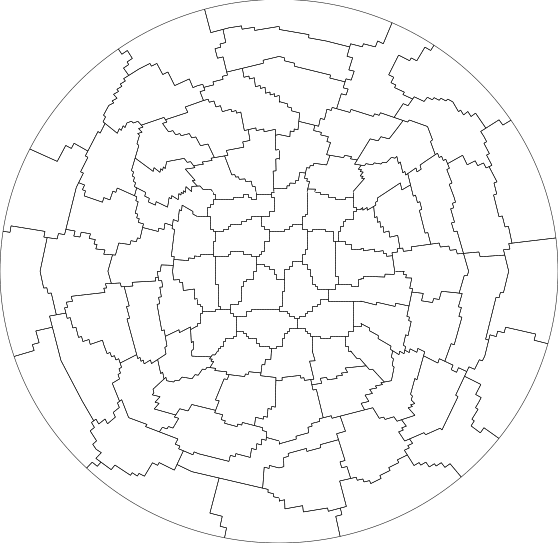

# polytopal (Polydeal)

Polytopal discontinuous Galerkin building blocks with agglomeration and
multigrid support, used to explore general mesh discretizations and
reduced-complexity workflows.

[Homepage](https://fdrmrc.github.io/Polydeal/) [Repository](https://github.com/fdrmrc/Polydeal)

  
  

- Focus: polygonal and polyhedral DG discretizations built on top of deal.II.
- Highlights: agglomeration-based multigrid, MPI support, R-tree driven mesh hierarchy generation.
- Local path: `tools/polygonal`
